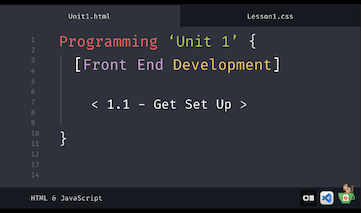

###### ICS3U Front End Dev - Mr. Brash 🐿️

# 1.1 - Get Set Up (How do we code?)

If you made it this far, you already followed the lesson from [my website](https://www.brash.ca/ics3/1/1) or [the slideshow](https://docs.google.com/presentation/d/e/2PACX-1vQQQEvIE9AtwewCXTbhTMF42z7Kph8fEG941_fTv1eKzKyBOmgzSp0hw5ZlUVEbM_ASYEB2X3yYz9m3/pub).

What you're reading is a [Markdown file](https://en.wikipedia.org/wiki/Markdown) (.md). You are reading it in a program called [Visual Studio Code](https://en.wikipedia.org/wiki/Visual_Studio_Code) (VS Code). VS Code is owned and maintained by Microsoft. Anyone can download and install VS Code on their computer in order to create and maintain computer code and other filetypes.

Our class uses VS Code inside [virtual machines](https://en.wikipedia.org/wiki/Virtual_machine) because we all work on different types of computers (Chromebooks, borrowed laptops, etc).

We will be saving our code with a special [Version Control](https://en.wikipedia.org/wiki/Version_control) tool called [Git](https://en.wikipedia.org/wiki/Git), pushing backups of our code to our [Gitea server](https://about.gitea.com/).

🐿️

---
<table style="width: 100%;">
  <tr>
    <td align="left"><a href="./1.0 - README (ToC).md">Table of contents</a></td>
    <td align="right"><a href="./1.2 - Basic HTML">1.2 - Basic HTML</a></td>
  </tr>
</table>

