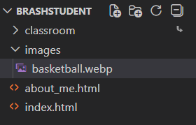
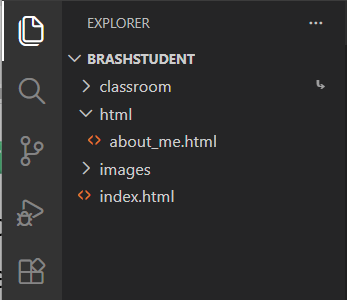

###### ICS3U Front End Dev - Mr. Brash  🐿️

# 1.3 - More HTML

Table of Contents
- [Recall - The Proper Structure of an HTML file](#recall---the-proper-structure-of-an-html-file)
- [More HTML Tags](#more-html-tags)
  - [Hyperlinks](#-links-aka-hyperlinks) (the anchor tag)
  - [Images](#️-pictures)
- [Your Task](#your-task)

<br>


## Recall - The Proper Structure of an HTML file:

Let's take a look at a blank (empty) HTML document:
```HTML
<!DOCTYPE html>

<html>

  <head>
    <title> </title>
  </head>

  <body>

  </body>
  
</html>
```


## More HTML Tags

Once you understand the tag system HTML becomes very easy **_but you want to do more!_**  
You can always use [w3schools.com](https://w3schools.com) to lookup tutorials and "how-tos". Just know that their way isn't always the most up-to-date or proper way.

### 🔗 Links (aka "hyperlinks")

To make text, images, or _anything_ clickable, you must use the `anchor` tag. It is simply `<a>` but you must also use the `href` "option" to tell the browser where to go when the item is clicked. **Example:**
```HTML
  To learn more, visit <a href="examples.html">the examples page</a>.
```

In the example above, the words `the example page` become "hyper" and will send the user to `examples.html` when clicked.  
You can surround almost anything in the anchor tag and it does [more than just links](https://www.w3schools.com/tags/tag_a.asp).

---

### 🖼️ Images

**This topic is a bit detailed, read carefully.**

- To insert a picture, use the `` tag with a _source_ option of where to find the file: ``
- The `img` tag does _not_ require a closing tag - similar to `<br>`. It is an _instruction_ to insert the picture.

#### Example:
```HTML

```
**NOTE:** You are **_not_** permitted to "hotlink" to someone else's picture online. 

#### ❌ Bad:
```HTML

```
#### ❌❌ WORSE:
```HTML

```


#### ✅ Good:
Download the picture, name it something nice and place it in a folder of _your_ webserver.  
Typically in an `images` folder. ⚠️ Look out for typos and spelling!



Now link to _your_ copy of the image:

```HTML

```

#### 🔃 Sizing an image:

To resize an image there are _many_ options but the easiest is the `width` _or_ `height` option (don't use both):
```HTML
  Be 50% of the page width
  Be 640 pixels wide (you can also use 640px)
```

The **height** of the image will be sized relative to the width you set and vice versa.

### Clickable Images

To make an image hyper, simply surround it with the anchor tag:
```HTML
<a href="https://some.other.website.com">
  
</a>
```
(⬆️ notice how that code is structured and _tabbed_)

### Paths

When you link to a file or website, there are two types of paths - **absolute** and **relative**.

#### Absolute Paths

If you give the full URL (path), this is called _absolute_. **Example**:
```HTML
Click <a href="https://www.mysite.com/html/topic/folder/file.html">here</a> to read more.
```
- Pros:
  - you know the exact path and you can copy/paste it in
- Cons:
  - if the location ever changes or you move your webserver / site to another server you have to find and change all your paths
  - hard to read

#### Relative Paths

Whatever file (document) you are currently in becomes the "parent". Any locations you want to use become _relative_ to it.  
Subfolders and files are simply listed:
```HTML

In this example "book_covers" is a folder in the same location as the HTML file.
```
Previous or _parent_ folders can be traversed using `../`:
```HTML

In this example the "images" folder is two folders back from location of the current HTML file.
```

# Your Task:

Lets organize our website better and add some pictures.

1. The `html` folder:
    - Create a folder called `html`.
    - Move your `about_me.html` file into the new `html` folder
2. The `images` folder:
    - Create a folder called `images` (**_not_** inside the `html` folder)  

    It should look like this:  
    

3. In your `index.html` you have a line that says "About Me". That should be a _hyperlink_ to your `about_me.html` page. Use the anchor tag and a _relative path_ to make this happen. **Test your link**

4. In your `about_me.html` you have a line that says "Back to Main Index". Make that a _hyperlink_ to your `index.html` file. Use a _relative path_ to make this happen. **Test your link**

5. Find some pictures (images) that have significance to you. Maybe it's a hobby, a sport, or even a picture of _you_.
    - Name the files appropriately (avoid spaces)
    - Place / upload the image files in your `images` folder
    - Add those images to your `about_me.html` page
      - Feel free to put them between your paragraphs, etc...
      - Size them appropriately for the space

6. Make _at least_ one of those images a link to an external website about that topic. For example, if it's a picture of an NFL player make it link to their profile page on nfl.com.

### {Optional}
Learning HTML is pretty easy with Google and [W3Schools](https://w3schools.com). Why not look up how to change the background colour of a page or paragraph? 

🐿️

---
<table style="width: 100%;">
  <tr>
    <td align="left"><a href="1.0 - README (ToC).md">Table of contents</a></td>
    <td align="right"><a href="1.4 - Headings Lists & Tables.md">1.4 - Headings, Lists & Tables</a></td>
  </tr>
</table>
