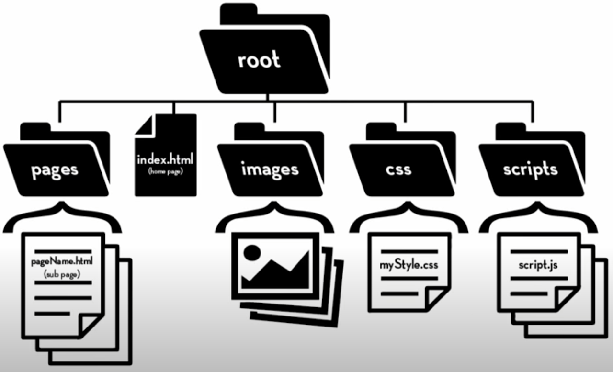

###### ICS3U Front End Dev - Mr. Brash 🐿️

# 1.6 - Introduction to CSS (Style)

Table of Contents
- Recall
  - [HTML](#html)
  - [Organization](#organization)
  - [Git and Gitea](#git--gitea)
- [CSS: Cascading Style Sheets](#css-cascading-style-sheets)
- [Your Task](#your-task)

### HTML
So far we've learned:
- The [structure of an HTML document](https://www.w3schools.com/html/html_intro.asp)
- [Various HTML tags](https://www.brash.ca/ics3/1/5x) for things like text, tables, lists, and images
  - Most tags have lots of optional attributes
- [w3schools](http://www.w3schools.com/html) and Google are your best friend for learning HTML!



### Organization

We also discussed how to keep your files **organized**. The recommended folder structure is:

- **images** (or _media_)
- **html** (or _pages_)
- **css** (or _style_)
- **scripts**

You **must** have an `index.html` at the root of your website.

### Git & Gitea

We also _briefly_ looked at copying (cloning) a repository with `git clone [URL]` and the process of backing-up all our files:
```TXT
git add .
git commit -m "<some message>"
git push
```

👉🏻 Don't worry, we'll look at `git` commands throughout the semester.

## CSS: Cascading Style Sheets

###  Websites (and Apps)


A website consists of three pieces:
1. The content (HTML)
2. **The look (CSS)**
3. The interaction (JavaScript or JS)


There are 3 (three) ways to include *style* in your HTML.

### 1. Inline Style 🤮
#### (aka the *messy* wrong way)

We can add style to *one* tag, using the `style=""` attribute, separating style commands with a semicolon (`;`):
```HTML
<p id="p1" style="text-align:center;color:purple;font-size:1em;">
  Lipsem orem, blah blah blah.
</p>
<p id="p2" style="text-align:center;color:purple;font-size:1em;">
  A second paragraph.
</p>
```

<p id="p1" style="text-align:center;color:purple;font-size:1.5em;">
  Lipsem orem, blah blah blah.
</p>
<p id="p2" style="text-align:center;color:purple;font-size:1.5em;">
  A second paragraph.
</p>


### 2. Head Style 🙈
#### (aka the *clean* but wrong way)

Inside the `<head>` of the document, we can use the `style` tag do *define* styles for our tags:

```HTML
<head>
  <title>1.6 - CSS</title>
  <style>

    body {
      font-size: 100%;
      margin: 10px;
    }

    p {
      text-align:center;
      color:purple;
      font-size:1.5em;
    }

  </style>

  <p id="p1">
    Lipsem orem, blah blah blah.
  </p>
  <p id="p2">
    A second paragraph.
  </p>

</head>
```

### 3. Using a Separate .css file ✔ 👍

Inside a separate file, you can define your styles and then load the file into your HTML with [the `<link>` tag](https://www.w3schools.com/tags/tag_link.asp):

```HTML
<link rel="stylesheet" href="path_to_css/main_style.css">
```

In the above example the `rel` attribute tells the browser the *relationship* between this document and the linked file.

The `.css` file will contain all the style definitions you would like for this particular theme/page/usage. You can also create as many `.css` files as you like and load them on any `.html` document you like.

**Example `style.css` file:**

```CSS
/* Elements */
body {
  font-size: 100%;
  margin: 10px;
}

p {
  text-align:center;
  color:purple;
  font-size:1.5em;
}

/* IDs */
#intro_paragraph {
  text-align: left;
  color: black;
  font-size:1em;
}

/* Classes */
.container {
  margin: 20px;
  background-color: grey;
}
```

### 🕐 Learning style commands and options can take *weeks*. I highly recommend you [learn as you go](https://www.w3schools.com/css/).

<br>

# Your Task

1. Make sure your `1.5-HTML` code is backed up:  
    ```TXT
    (from your 1.5-HTML folder)
    git add .
    git commit -m "1.8 CSS Backup"
    git push
    ```
2. Create a `style.css` file next to your `index.html`  

3. Create a background [colour](https://www.w3schools.com/css/css_colors_rgb.asp) for your pages:  
    ```CSS
    body {
      background-color:rgb(200, 160, 30);
    }
    ```
4. Add a link to your `style.css` file inside `index.html`:  
    ```HTML
    index.html:
    
    <head>
      ...
      <link rel="stylesheet" href="style.css">
    </head>
    ```
5. Add a link to that same `style.css` file in your `legacy.html` _and_ `bibliography.html` files. **Don't forget about proper paths!**

6. **Play:** Practice some interesting style properties like `color`, `font-family`, `font-size`, `border-radius` (on images) [**and so much more**](https://www.w3schools.com/css/css_intro.asp)!  

7. Any time you want to backup your code, do the following:
    ```TXT
    (from your 1.5-HTML folder)
    git add .
    git commit -m "Put a message here describing what you have accomplished"
    git push
    ```

<br>
<br>

🐿️

---
<table style="width: 100%;">
  <tr>
    <td align="left"><a href="./1.0 - README (ToC).md">Table of contents</a></td>
    <td align="right"><a href="./1.? - ????.md"></a></td>
  </tr>
</table>

