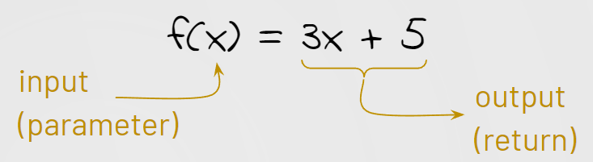

###### ICS3U U2: JavaScript - Mr. Brash 🐿️

# 2.7 - Return

  

<br>

**If you missed the live demonstration in class, read below. Otherwise you can go straight to [your task](#-your-task).**

- Don't like reading? [Here's a video on the _`return`_ statement](https://youtu.be/qV4PHIp-PNs)


## Lesson: Return

Did you notice that your console would say `undefined` after running your custom functions? That's because your function wasn't giving a result - it gave no output.


**Printing a value to the console is useful for the developer but how can we _use_ that value for more work?**

The `Math.sqrt(x)` function _gives back_ the square root of a number. It does not print it to the console, we have to do that ourselves:
```JS
let s = Math.sqrt(16);
console.log(s)
```

🤔 How is it _giving back_ the number 4 so we can store it in a variable?

Let's look at a custom function `power` function:
```JS
// Raise a base to an exponent
function power(base, exponent) {
    let answer = base**exponent;
    console.log(answer);  
}
```

That `power` function is a little useless. Sure it prints to the console, but the user doesn't see the console. **What if we wanted to use it for the Pythagorean Theorem?**

🤔 What if we remove the `console.log(answer)`? Where does the answer go?

> **It goes nowhere**

In order to provide a single value as usable output from a function, use the keyword `return`.

```JS
// Raise a base to an exponent
function power(base, exponent) {
    let answer = base**exponent;
    return answer;  
}
```

That tells the function to **end** and give the value to whoever called it.

```JS
// Calculate the length of the hypotenuse given two side lengths
function pythag(a, b) {
  let c = Math.sqrt( power(a, 2) + power(b, 2) )
  return c
}
```

⚠️ It's very important to know that if you want to see the result on the console you will need to print it yourself, unless your function is the last one called.

⚠️⚠️ It's also important to know that the function will STOP at _any_ `return` keyword and if you don't have a `return` your function returns `undefined`.


### 💻 Your Task

1. In [the previous lesson](2.6%20-%20Function%20Parameters.md) you created a function called `rollDice(sides)` which rolls two dice with `sides` number of sides and adds the result, printing it to the console. **Change your function so that it no longer prints to the console, it _returns_ the value**.

2. `square(value)` - which squares the given value and _returns_ the answers.

3. In mathematics, the "Discriminant" is a portion of the quadratic formula that helps us determine the number of roots. You don't need to know the math, you just need to do the following...  Create the function `discriminant(a, b, c)` which calculates and _returns_ the result of `b²-4ac`. _You must use your `square()` function you made in #2_. **Your function should only _return_ the numeric answer to the calculation, not the number of roots.**

4. `madlib(noun, verb, adjective)` - which _returns_ a string made up of the following:
"Today I went to the zoo and saw a very [adjective] [noun]. It was trying to [verb] in the cage! I have never seen anything like it before." Replace each item with the parameter given in the function.


<br>


🐿️


---

<table style="width: 100%;">
  <tr>
    <td align="left" valign="top"><a href="2.6 - Function Parameters.md">2.6 - Function Parameters</a></td>
    <td align="center"><a href="2.0 - Table of Contents.md">Table of contents</a><br><br>(2.7 - Return)</td>
    <td align="right" valign="top"><a href=""></a>Unit 2 Assessment (Coming soon...)</td>
  </tr>
</table>