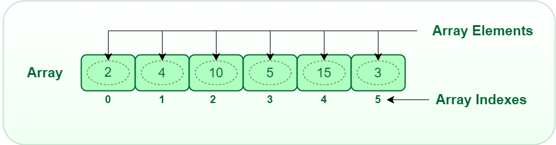

###### ICS3U U4: Arrays & Displays - Mr. Brash 🐿️

# 4.1 - Arrays

**If you missed the live demonstration in class, read below. Otherwise you can go straight to [your task](#practice-tasks).**

- [Create a Repo](#create-a-new-repository)
- [Lesson: Arrays](#the-lesson-arrays)
- [Practice Tasks](#practice-tasks)
- [Challenge Tasks](#challenge-tasks)

🔙 [Back to the Table of Contents](4.0%20-%20Table%20of%20Contents.md)

---

### Create a new Repository

So far you have always copied a repository from your teacher. It's time to make your own repository.

- Head over to [git.mthdev.ca](https://git.mthdev.ca)
- In the very top-right, near your profile image, there is a plus (`+`). Click that and then `New Repository`
- In the new window, name your repository `Unit-4`
- You can leave the rest as it is and click `Create Repository` at the bottom.
- Clone your brand new repository into your VSCode environment.
- The repo will be _empty_.
  - Do you remember what you need?
  - Where can you find an example?
  - Should you create a commit once you have your files setup?

---


### The Lesson: Arrays

[🔝 Back Up](#41---arrays)

`Strings` are a very special type of variable. They are **an array**. Almost every programming language in the world has Arrays - at least as an add-on. Arrays let us package multiple values together in one variable. Kind of like a string of letters but instead it could be numbers or booleans or whatever data you need to store.

Imagine creating a contact list program. Every contact that gets added is another piece of data that has to go in a variable. But if you don't know how many contacts there will be - how do you know how many variables to make? `contact1, contact2, ... contact999`?




**Examples**:
```JS
// Make an array of numbers
let someNumbers = [2, 4, 5, 0, -9, 5, 2, 1, 2, 4];
console.log(someNumbers.length);  // 10
console.log(someNumbers[2]);      // What gets printed?
```

---

One of the biggest differences between _Strings_ and _Arrays_ - you **can** modify an array. 

```JS
console.log(someNumbers[1]);  // 4
someNumbers[1] = 17;
console.log(someNumbers[1]);  // 17
```

---

In _JavaScript_ and _Python_, an Array can contain a mixture of any type of data. (Python calls them _lists_). Other programming languages can only hold one _type_ of data in an array - due to memory security and restrictions.

```JS
let myArray = ["This is text", 4, 5, true];
```
---
We can loop through arrays just like we did with Strings!

```JS
for (let i = 0; i < myArray.length; i++) {
  myArray[i] += i;    // Add the current index to the current element
}
```
---
We can add an element to the **end** of an existing array with `.push()`

```JS
myArray.push("Some more text");
```

We can also _remove_ the last element with `.pop()` ([read about it here](https://www.w3schools.com/jsref/jsref_pop.asp))

---

We can declare an empty array two ways:
```JS
let my_array_for_later = [];     // Don't know the size

let my_other_array = new Array(20);  // Empty array of 20 slots
```

#### There are other built-in functions as well, [that you can look up online](https://www.w3schools.com/js/js_arrays.asp).


## Practice Tasks

[🔝 Back Up](#41---arrays)

**Here are some sample arrays, if you want them for testing:**
```JS
let justNumbers = [1, 3, 9, 7, -5, 7, 9, 9, -3.14];
let justStrings = ["3", "castle", "-98", "cookie", "sandwich", "Hi"];  
let mixedArray = [9, -7, "Deadpool", true, 1, null, false, "pizza", NaN, -3];

// We can put anything in a JavaScript array and use new-lines after a comma:
let test_array4 = [0, 0, 10, 0, test_array2, 0,
                   true, test_array3, "Mr. Squirrel",
                   -50, test_array1, "💩", [1,2]];
```

### `print_array( )`

1. Create the function `print_array(arr)` that prints the elements of the array `arr` to the console one-by-one, each on a new line. _This will be very similar to printing each letter of a String_.
<br>**Example:**

    ```JS
    let my_array = [56, 34, -99, "Hello", true, "Good bye", 0, -1, 42];

    print_array(my_array);  // Should print all the contents, each on a new line

    // OR:
    print_array([1, 1, 2, 3, 5, 8, 13]);  // Again, should print each on a new line
    ```

### `min( )`

2. Create the function `min(arr)` that goes through a _numeric_ array and **_returns_ the lowest numeric value** in the array. It's safe to assume that the input parameter `arr` is an array of numbers and has at least one value.
<br>**Examples:**

    ```JS
    let my_array = [7,2,-4,5,2,9,8,0,1,3,9,-5,-1,5,-1,-8,2,3];
    min(my_array);            // returns -8
    min([6,5,4,3,2,3,4,5,6])  // returns 2
    min([5,5,5,5,5,5,5]);     // returns 5
    ```

### `longest_string( )`

3. Create the function `longest_string(arr)` that goes through an array of _Strings_ and returns the _**length**_ of the longest String in the array. It should return the _length_, not the string. It's safe to assume that the input parameter `arr` is an array of only Strings and has at least one value in it.

**Extension Question:** How would you have it return the longest string?


### `contains( )`

4. Arrays have a built-in `.includes()` that will tell you if the given element exists in the array. We're going to recreate that function. Create the function `contains(arr, value)` that returns `true` if the `arr` contains a copy of the given `value`. It should return `false` otherwise.
  <br>**Examples:**

    ```JS
    let someValues = [1, 2, 3, 4, "hello"];
    contains(someValues, "hello");   // Returns true
    contains(someValues, 5);         // Returns false
    contains(someValues, "HELLO");   // Returns false
    contains(someValues, 2);         // Returns true
    contains(someValues, "2");       // Returns false
    ```

    **Remember:**
    The double-equals only compares _value_ and JavaScript thinks `2` and `"2"` are equal in value. The triple-eqauls also compares _data type_.
    ```JS
    2 == "2"    // true
    2 === "2"   // false
    ```

<br>

## Challenge Tasks

[🔝 Back Up](#41---arrays)

5.  Create the function `min_max(arr)` that returns _an array_ with two elements: `[min, max]`
  <br>**Examples:**
    ```JS
    let my_array = [7,2,-4,5,2,9,8,0,1,3,9,-5,-1,5,-1,-8,2,3];
    minMax(my_array);  // returns [-8, 9]

    minMax[5,5,5,5,5,5,5]);  // returns [5, 5]
    ```
<br>

6. Create the function `sum(arr)` that returns the sum of _any element that could be considered a number_ in the array. For the purposes of this task, anything that can be _converted_ to a number is good. For example the value "9" **is** considered numeric. So is `true` (equates to 1). Hint: we have learned about the [isNaN( )](https://www.w3schools.com/jsref/jsref_isnan.asp) function in previous work.
    <br>**Examples:**
    ```JS
    sum([1,2,3,4,5]);  // returns 15

    let x = ["Hello", "4", 3, "s'up?", true];
    sum(x);  // returns 8 because of "4", 3, and true

    // The boolean keyword true equates to a numeric value!
    ```
    **Hint:** for this you _might_ need such things as [isNaN](https://www.w3schools.com/jsref/jsref_isnan.asp), [Number](https://www.w3schools.com/jsref/jsref_number.asp), and [typeof](https://www.w3schools.com/js/js_typeof.asp).

<br>

7. Create the function `reverse_strings(arr)` that goes through the given `arr` of Strings and does the following:
   - Print each string to the console _reversed_ (without using any built-in reverse functionality or `.split()` or `.join()`)
   - _Returns_ an _array_ of the reversed strings --> _also in reverse_.
    
    <br>**Example:**
    ```JS
    let my_strings = ["Hello", "Goodbye", "Coding is fun!", "Strings are easy.", "zzzzzzz"]
    reverse_strings(my_strings);
    // Prints the following:
    olleH
    eybdooG
    !nuf si gnidoC
    .ysae era sgnirtS
    zzzzzzz

    // Returns the following:
    ["zzzzzzz", ".ysae era sgnirtS", "!nuf si gnidoC", "eybdooG", "olleH"]
    ```
    

<br><br>
🐿️


<br>


---

<table style="width: 100%;">
  <tr>
    <td align="left" valign="top"><a href="4.0 - Table of Contents.md">Unit 4 ToC</a></td>
    <td align="center"><a href="4.0 - Table of Contents.md">Table of contents</a><br><br>(4.1 - Arrays)</td>
    <td align="right" valign="top"><a href="4.2 - Element IDs.md">4.2 - HTML Element IDs</a></td>
  </tr>
</table>