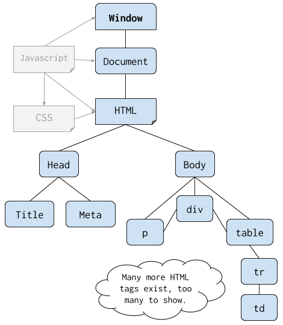

###### ICS3U U4: Arrays & Displays - Mr. Brash 🐿️

# 4.2 - HTML Element IDs

#### The time has come! We are going to connect the front-end (HTML) to the back-end (JS)!

**If you missed the live demonstration in class, read below. Otherwise you can go straight to [your task](#practice-tasks).**

- [Lesson: Arrays](#the-lesson-arrays)
- [Practice Tasks](#practice-tasks)
- [Challenge Tasks](#challenge-tasks)

🔙 [Back to the Table of Contents](4.0%20-%20Table%20of%20Contents.md)

---

### The Lesson: HTML Element IDs

**Loading JavaScript in HTML**

As a reminder, HTML will load a JavaScript file by adding it to the `<head>` of the document.

```HTML
<head>
  ...
  <script src="./main.js" defer></script>
</head>

```
Note the keyword `defer`. It waits for the HTML page to finish loading and _then_ loads the script. Without `defer`, the script will run right away - before the `<body>` loads.

#### HTML Element IDs:

All page elements you want to control or modify _must_ have a unique identifier.

`index.html`:
```HTML
<body>
  ...
  <p id="instructions">Blah blah blah</p>

  <div id="score">100</div>

  <button id="quit_button">Quit</button>

  

  <input type="text" id="username">
  ...
</body>
```

#### The `document` object model ([DOM](https://www.w3schools.com/js/js_htmldom.asp)):




The DOM is a representation of the HTML document with child and parent element "objects". JavaScript has the ability to directly manipulate the DOM in real-time, creating a sense of interactivity that we don't normally see from a regular document.

For example, a Google Doc is an HTML page that is manipulated "on-the-fly" as the user interacts with it. This is done using JavaScript.

To read or modify elements on a page, we use the JavaScript [`document`](https://www.w3schools.com/js/js_htmldom_document.asp) _object_, similar to how we used the `console` and `Math` objects.

`main.js`:
```JS
let score_div = document.getElementById("score");

// Get the score (if you want it)
let score = Number(score_div.textContent)

// Modify the score (if you want to)
score_div.textContent = 999;
```

> ☝ It's important to understand that [`document.getElementById()`](https://www.w3schools.com/jsref/met_document_getelementbyid.asp) returns the actual _Node_ or _Element_ on the page not just the text or value of that object.

#### Document Element Properties

Depending on the type of page element, there are different properties available. When in doubt - [look it up](https://www.w3schools.com/Jsref/dom_obj_all.asp).

`[element].textContent` - all text in an element and child elements, even if it is hidden by CSS tricks.

`[element].innerText` - all _visible_ text inside an element. Does not include text hidden by CSS.

`[element].innerHTML` - the actual HTML code/content of the specific element.

## Practice Tasks

[🔝 Back Up](#42---html-element-ids)

**Here are some sample arrays, if you want them for testing:**
```JS
let justNumbers = [1, 3, 9, 7, -5, 7, 9, 9, -3.14];
let justStrings = ["3", "castle", "-98", "cookie", "sandwich", "Hi"];  
let mixedArray = [9, -7, "Deadpool", true, 1, null, false, "pizza", NaN, -3];

// We can put anything in a JavaScript array and use new-lines after a comma:
let test_array4 = [0, 0, 10, 0, test_array2, 0,
                   true, test_array3, "Mr. Squirrel",
                   -50, test_array1, "💩", [1,2]];
```

### `print_array( )`

1. Create the function `print_array(arr)` that prints the elements of the array `arr` to the console one-by-one, each on a new line. _This will be very similar to printing each letter of a String_.
<br>**Example:**

    ```JS
    let my_array = [56, 34, -99, "Hello", true, "Good bye", 0, -1, 42];

    print_array(my_array);  // Should print all the contents, each on a new line

    // OR:
    print_array([1, 1, 2, 3, 5, 8, 13]);  // Again, should print each on a new line
    ```

### `min( )`

2. Create the function `min(arr)` that goes through a _numeric_ array and **_returns_ the lowest numeric value** in the array. It's safe to assume that the input parameter `arr` is an array of numbers and has at least one value.
<br>**Examples:**

    ```JS
    let my_array = [7,2,-4,5,2,9,8,0,1,3,9,-5,-1,5,-1,-8,2,3];
    min(my_array);            // returns -8
    min([6,5,4,3,2,3,4,5,6])  // returns 2
    min([5,5,5,5,5,5,5]);     // returns 5
    ```

### `longest_string( )`

3. Create the function `longest_string(arr)` that goes through an array of _Strings_ and returns the _**length**_ of the longest String in the array. It should return the _length_, not the string. It's safe to assume that the input parameter `arr` is an array of only Strings and has at least one value in it.

**Extension Question:** How would you have it return the longest string?


### `contains( )`

4. Arrays have a built-in `.includes()` that will tell you if the given element exists in the array. We're going to recreate that function. Create the function `contains(arr, value)` that returns `true` if the `arr` contains a copy of the given `value`. It should return `false` otherwise.
  <br>**Examples:**

    ```JS
    let someValues = [1, 2, 3, 4, "hello"];
    contains(someValues, "hello");   // Returns true
    contains(someValues, 5);         // Returns false
    contains(someValues, "HELLO");   // Returns false
    contains(someValues, 2);         // Returns true
    contains(someValues, "2");       // Returns false
    ```

    **Remember:**
    The double-equals only compares _value_ and JavaScript thinks `2` and `"2"` are equal in value. The triple-eqauls also compares _data type_.
    ```JS
    2 == "2"    // true
    2 === "2"   // false
    ```

<br>

## Challenge Tasks

[🔝 Back Up](#41---arrays)

5.  Create the function `min_max(arr)` that returns _an array_ with two elements: `[min, max]`
  <br>**Examples:**
    ```JS
    let my_array = [7,2,-4,5,2,9,8,0,1,3,9,-5,-1,5,-1,-8,2,3];
    minMax(my_array);  // returns [-8, 9]

    minMax[5,5,5,5,5,5,5]);  // returns [5, 5]
    ```
<br>

6. Create the function `sum(arr)` that returns the sum of _any element that could be considered a number_ in the array. For the purposes of this task, anything that can be _converted_ to a number is good. For example the value "9" **is** considered numeric. So is `true` (equates to 1). Hint: we have learned about the [isNaN( )](https://www.w3schools.com/jsref/jsref_isnan.asp) function in previous work.
    <br>**Examples:**
    ```JS
    sum([1,2,3,4,5]);  // returns 15

    let x = ["Hello", "4", 3, "s'up?", true];
    sum(x);  // returns 8 because of "4", 3, and true

    // The boolean keyword true equates to a numeric value!
    ```
    **Hint:** for this you _might_ need such things as [isNaN](https://www.w3schools.com/jsref/jsref_isnan.asp), [Number](https://www.w3schools.com/jsref/jsref_number.asp), and [typeof](https://www.w3schools.com/js/js_typeof.asp).

<br>

7. Create the function `reverse_strings(arr)` that goes through the given `arr` of Strings and does the following:
   - Print each string to the console _reversed_ (without using any built-in reverse functionality or `.split()` or `.join()`)
   - _Returns_ an _array_ of the reversed strings --> _also in reverse_.
    
    <br>**Example:**
    ```JS
    let my_strings = ["Hello", "Goodbye", "Coding is fun!", "Strings are easy.", "zzzzzzz"]
    reverse_strings(my_strings);
    // Prints the following:
    olleH
    eybdooG
    !nuf si gnidoC
    .ysae era sgnirtS
    zzzzzzz

    // Returns the following:
    ["zzzzzzz", ".ysae era sgnirtS", "!nuf si gnidoC", "eybdooG", "olleH"]
    ```
    

<br><br>
🐿️


<br>


---

<table style="width: 100%;">
  <tr>
    <td align="left" valign="top"><a href="4.1 - Arrays.md">4.1 - Arrays</a></td>
    <td align="center"><a href="4.0 - Table of Contents.md">Table of contents</a><br><br>(4.2 - Element IDs)</td>
    <td align="right" valign="top"><a href=""></a>4.3 Coming Soon...</td>
  </tr>
</table>